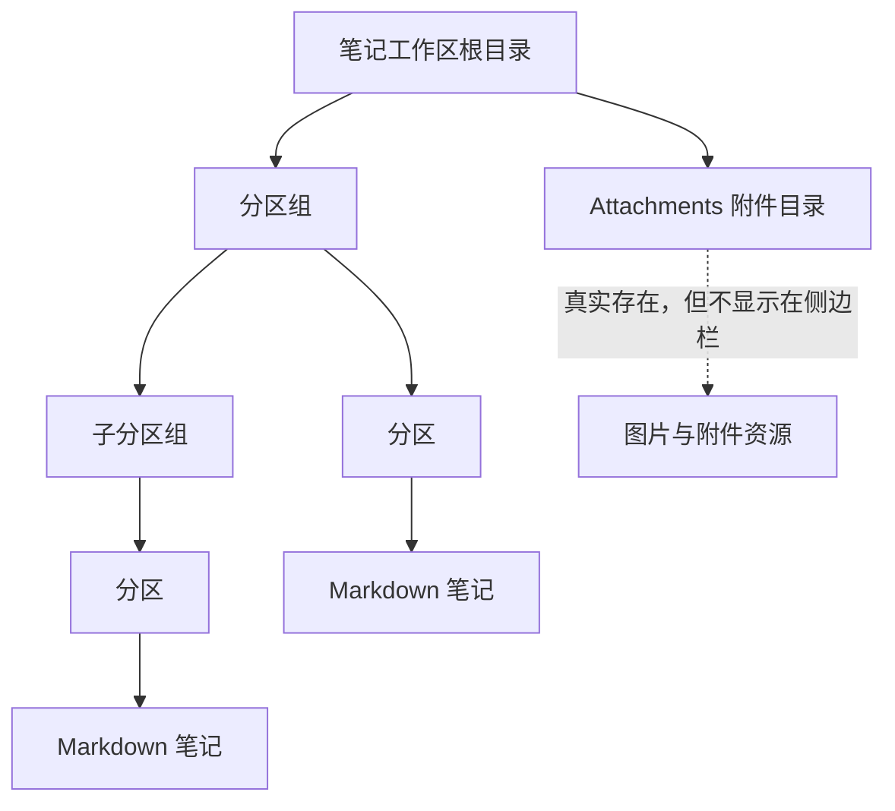
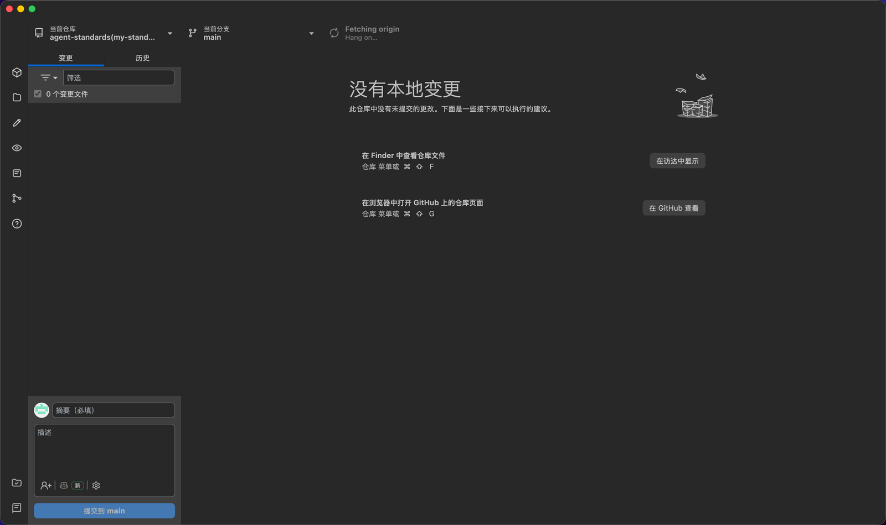

<p align="center"></p>

<h1 align="center">MarkNotePro</h1>

<div align="center">
  <strong>集成 Git 的本地 Markdown 笔记工具</strong><br>
  用本地目录管理笔记，用 Markdown 保存内容，用 Git 做版本管理、同步和恢复。<br>
  <sub>支持 Linux、macOS、Windows。</sub>
</div>

<br>

<div align="center">
  <a href="LICENSE">
    
  </a>
  <a href="https://github.com/scott20201225/marknote-pro/releases">
    
  </a>
  <a href="https://github.com/scott20201225/marknote-pro/releases/latest">
    
  </a>
</div>

<div align="center">
  <h3>
    <a href="#产品定位">产品定位</a>
    <span> | </span>
    <a href="#核心能力">核心能力</a>
    <span> | </span>
    <a href="#产品选择">产品选择</a>
    <span> | </span>
    <a href="#笔记工作区模型">工作区模型</a>
    <span> | </span>
    <a href="#git-联动">Git 联动</a>
    <span> | </span>
    <a href="#截图与演示">截图与演示</a>
    <span> | </span>
    <a href="#下载安装">下载安装</a>
  </h3>
</div>

## 产品定位

MarkNotePro 是一款本地优先的 Markdown 笔记工具。它不是一个松散的外部文件编辑器，而是围绕“笔记工作区”建立的个人知识管理客户端：左侧负责笔记结构，右侧负责 Markdown 编辑，Git 区负责版本管理和远程同步。

它适合这些场景：

- 把个人笔记、项目资料、长期知识库放在一个本地目录中管理。
- 使用 Markdown 文件保存内容，避免被专有格式锁定。
- 通过 GitHub、Gitee、Coding 或其它 Git 服务同步笔记目录。
- 在多台电脑之间同步、回滚、查看历史版本。
- 希望笔记结构清晰，不希望普通文件夹和笔记体系互相污染。

## 产品选择

MarkNotePro 和 MarkTextPro 是两个相互独立、但能力互补的产品。

- MarkNotePro：集成 Git 的本地 Markdown 笔记工具，强调笔记工作区、分区组、分区、笔记和长期知识管理。
- MarkTextPro：集成 Git 的 Markdown 文件编辑管理器，强调自由文件夹、外部 Markdown 文件、项目文档和临时编辑。

相关地址：

- MarkNotePro GitHub：[https://github.com/scott20201225/marknote-pro](https://github.com/scott20201225/marknote-pro)
- MarkNotePro Releases：[https://github.com/scott20201225/marknote-pro/releases/latest](https://github.com/scott20201225/marknote-pro/releases/latest)
- MarkTextPro GitHub：[https://github.com/scott20201225/marktext-pro](https://github.com/scott20201225/marktext-pro)
- MarkTextPro Releases：[https://github.com/scott20201225/marktext-pro/releases/latest](https://github.com/scott20201225/marktext-pro/releases/latest)

选择建议：

| 使用场景 | 推荐产品 |
| --- | --- |
| 你要长期维护个人笔记、知识库、项目资料，并希望结构稳定 | MarkNotePro |
| 你希望在分区组 / 分区 / 笔记结构下，通过 Git 同步长期笔记工作区 | MarkNotePro |
| 你希望使用分区组、分区、笔记这种清晰的笔记层级 | MarkNotePro |
| 你希望普通 Markdown 文件夹通过 Git 同步，但不需要笔记分区体系 | MarkTextPro |
| 你只是想自由打开任意文件夹或外部 Markdown 文件 | MarkTextPro |
| 你经常编辑项目 README、技术文档、临时 Markdown 文件 | MarkTextPro |
| 你不想被笔记体系限制，只需要一个带 Git 的 Markdown 文件管理器 | MarkTextPro |

## 核心能力

- **本地笔记工作区**：首次使用必须选择工作区，所有笔记围绕这个根目录组织。
- **分区组 / 分区 / 笔记**：用类似 OneNote 的结构管理 Markdown 笔记，减少普通文件夹式管理的混乱。
- **Tree / List 双模式**：既可以使用纯树结构，也可以使用“分区树 + 笔记列表”的方式快速定位笔记。
- **Markdown 所见即所得编辑**：支持标题、列表、任务、表格、引用、代码块、数学公式、Mermaid 等常用 Markdown 能力。
- **表格增强**：支持表格批量编辑、复制粘贴、与 Excel 互操作等高频办公能力。
- **本地附件目录**：插入本地图片时可复制到工作区附件目录，并使用相对路径引用，方便同步到其它电脑。
- **集成 Git 工作区**：内置 Git 操作界面，支持仓库添加、克隆、变更查看、提交、分支、拉取、推送等操作。
- **笔记工作区与 Git 仓库联动**：可以从 Git 仓库切换笔记工作区，也可以在笔记根目录重命名后同步更新 Git 仓库路径。

## 笔记工作区模型

MarkNotePro 的重点是“稳定的笔记结构”。根目录代表一个笔记工作区，根目录自身不折叠；根目录下展示分区组，分区组下可以继续包含子分区组或分区，分区下保存 Markdown 笔记。



工作区规则：

- 根目录用于承载整个笔记工作区，不作为普通笔记节点折叠。
- 分区组用于组织分区或子分区组。
- 分区用于保存笔记，笔记文件使用 Markdown 格式。
- 附件目录用于保存插入的本地图片等资源，界面中默认隐藏。
- 删除分区组、分区、笔记时会同步关闭相关已打开标签，避免编辑器继续指向旧路径。
- 重命名或移动笔记结构时，会同步更新已打开笔记的路径指向。

## Git 联动

MarkNotePro 把 Git 作为笔记工作区的版本管理能力，而不是额外割裂的工具。你可以在笔记区写作，也可以切换到 Git 区完成提交、拉取、推送和历史查看。


联动关系：

- Git 区可以选择仓库，切换前会确认，避免误点。
- 默认可以勾选“切换笔记工作区”，让笔记工作区跟随当前 Git 仓库。
- 也可以取消勾选，只切换 Git 仓库，保留当前笔记工作区。
- 从 Git 区可以把当前仓库根目录或仓库子目录设置为笔记工作区。
- 如果笔记根目录重命名，MarkNotePro 会同步更新受管 Git 仓库路径，避免 Git 区找不到仓库。
- 允许 Git 仓库和笔记工作区不是同一个目录，适合更复杂的本地目录规划。

## 截图与演示

[查看完整功能展示图](docs/assets/screenshots/showcase-overview.png)

<table>
  <tr>
    <td align="center" colspan="2">
      
      <br>
      <sub>在笔记区和 Git 区之间切换，完成仓库操作与工作区联动</sub>
    </td>
  </tr>
  <tr>
    <td align="center">
      
      <br>
      <sub>五种警告块样式</sub>
    </td>
    <td align="center">
      
      <br>
      <sub>段落菜单与警告块</sub>
    </td>
  </tr>
  <tr>
    <td align="center">
      
      <br>
      <sub>任务状态批量编辑</sub>
    </td>
    <td align="center">
      
      <br>
      <sub>列表缩进菜单</sub>
    </td>
  </tr>
  <tr>
    <td align="center" colspan="2">
      
      <br>
      <sub>插入面板</sub>
    </td>
  </tr>
  <tr>
    <td align="center" colspan="2">
      
      <br>
      <sub>表格工具能力</sub>
    </td>
  </tr>
  <tr>
    <td align="center">
      
      <br>
      <sub>表格复制粘贴</sub>
    </td>
    <td align="center">
      
      <br>
      <sub>Excel 与 MarkNotePro 表格互操作</sub>
    </td>
  </tr>
  <tr>
    <td align="center" colspan="2">
      
      <br>
      <sub>集成 Git 工作区：查看变更、历史、分支并提交同步</sub>
    </td>
  </tr>
</table>

## 下载安装


请从 [Release 页面](https://github.com/scott20201225/marknote-pro/releases/latest) 下载对应系统版本：

- macOS：`marknotepro-mac-(arm64|x64)-%version%.dmg`
- Windows：`marknotepro-win-(x64|arm64)-%version%-setup.exe`
- Linux：提供 `deb`、`rpm`、`snap`、`tar.gz` 等构建，具体以 Release 页面为准。

## 开发

```bash
pnpm install
pnpm --filter marknotepro dev
```

构建桌面端：

```bash
pnpm --filter marknotepro build
```

## 许可

[MIT](LICENSE)
