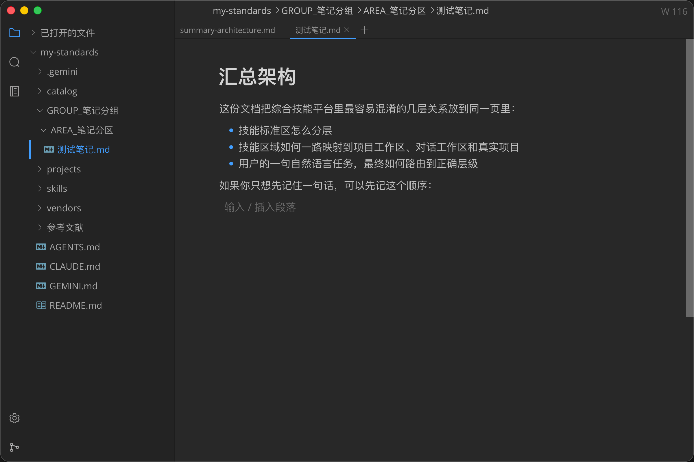
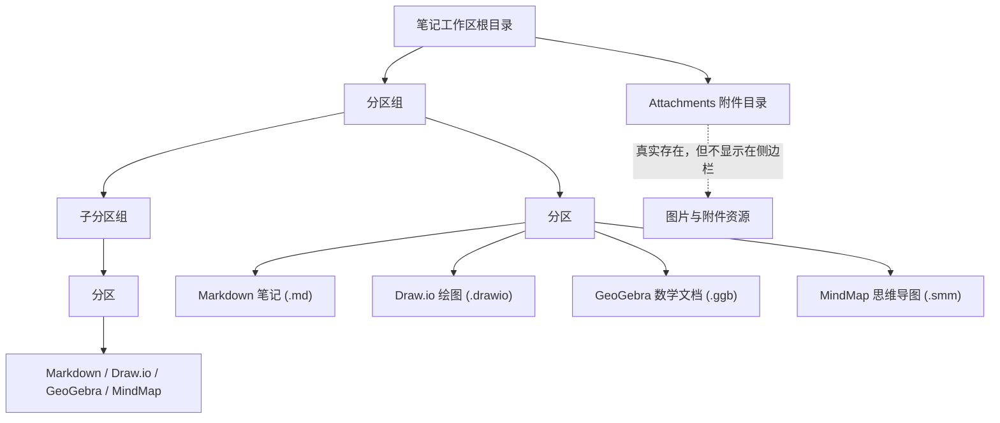
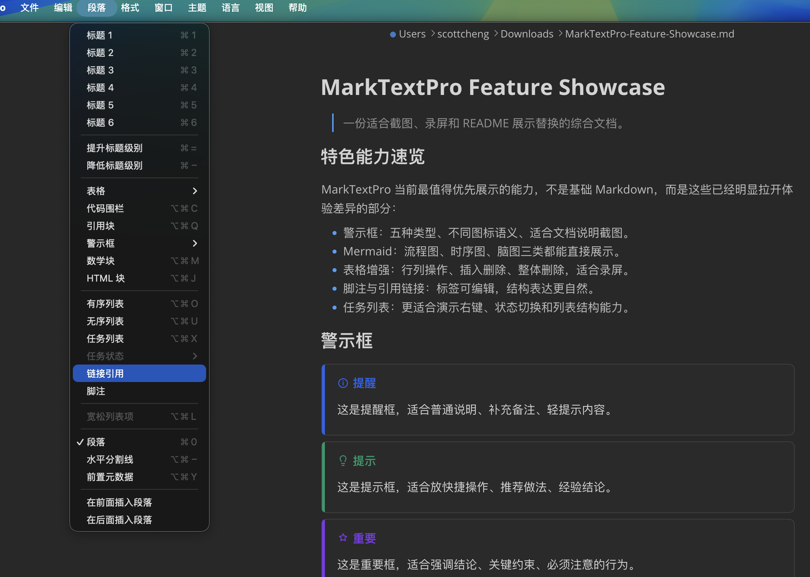
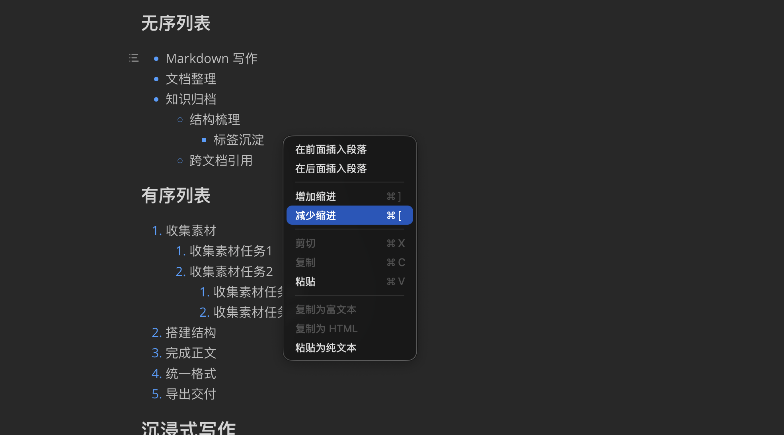
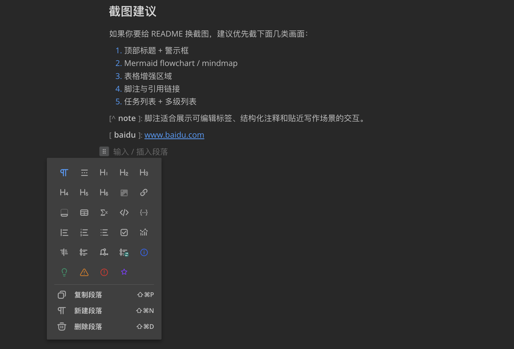
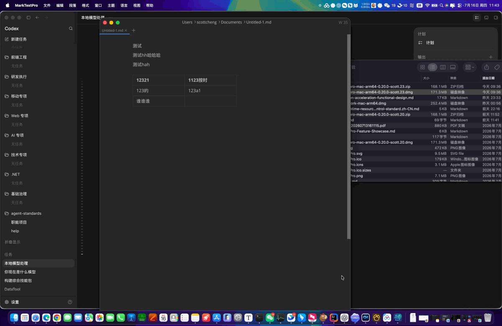
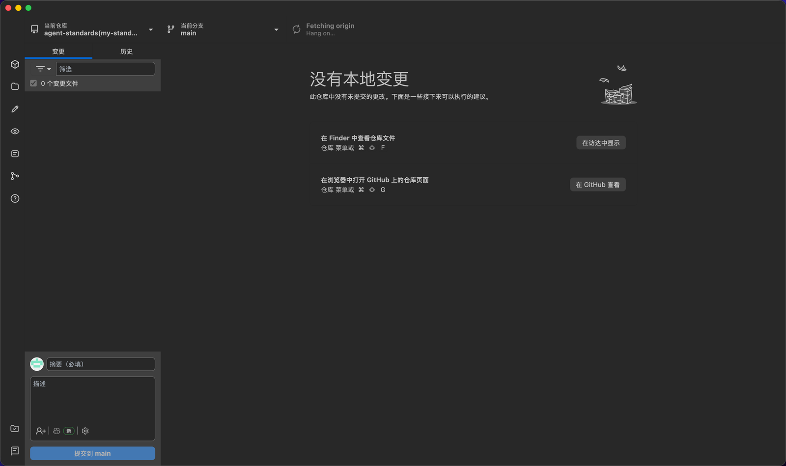

<p align="center"></p>

<h1 align="center">MarkNotePro</h1>

<div align="center">
  <strong>集成 Git、Draw.io、GeoGebra 与 MindMap 思维导图的本地 Markdown 笔记与知识工作台</strong><br>
  用本地目录管理知识库，原生支持 Markdown 笔记、Draw.io 专业绘图、GeoGebra 数学建模与 MindMap 思维导图，用 Git 做版本管理、同步和恢复。<br>
  <sub>支持 Linux、macOS、Windows。</sub>
</div>

<br>

<div align="center">
  <a href="LICENSE">
    
  </a>
  <a href="https://github.com/scott20201225/marknote-pro/releases">
    
  </a>
  <a href="https://github.com/scott20201225/marknote-pro/releases/latest">
    
  </a>
</div>

<div align="center">
  <h3>
    <a href="#产品定位">产品定位</a>
    <span> | </span>
    <a href="#核心能力">核心能力</a>
    <span> | </span>
    <a href="#内置创作引擎drawio-geogebra-与-mindmap">内置创作引擎</a>
    <span> | </span>
    <a href="#产品选择">产品选择</a>
    <span> | </span>
    <a href="#笔记工作区模型">工作区模型</a>
    <span> | </span>
    <a href="#git-联动">Git 联动</a>
    <span> | </span>
    <a href="#截图与演示">截图与演示</a>
    <span> | </span>
    <a href="#下载安装">下载安装</a>
  </h3>
</div>

## 产品定位

MarkNotePro 是一款本地优先的结构化知识管理与多模态创作工具。它不是一个松散的外部文件编辑器，而是围绕“笔记工作区”建立的个人知识管理客户端：左侧负责笔记与专业文档结构，右侧原生集成 **Markdown 编辑器**、**Draw.io 图表编辑器**、**GeoGebra 数学/几何计算引擎**与 **MindMap 思维导图工作台**，Git 区负责版本管理和远程同步。

它适合这些场景：

- 把个人笔记、技术架构图、数学/理工科推导、思维导图、项目资料与长期知识库放在同一个本地目录中管理。
- 使用开放通用的本地文件格式（`.md`、`.drawio`、`.ggb`、`.smm`）保存内容，避免被专有云服务锁定。
- 在同一工作区内直接创建和编辑 Draw.io 流程图/架构图、GeoGebra 数学建模，以及 MindMap 思维导图（支持思维导图、逻辑结构图、组织结构图、目录组织图、时间轴、鱼骨图等 6 种结构，33 套精选深浅色主题自适应，支持节点富文本、公式、关联线与 XMind/Markdown 格式导入导出），全程离线可用并随应用主题自适应。
- 通过 GitHub、Gitee、Coding 或其它 Git 服务同步整个知识库目录，在多台电脑之间无损同步、回滚、查看历史版本。
- 希望知识库结构清晰，不希望普通杂乱文件夹和笔记体系互相污染。

## 产品选择

MarkNotePro 和 MarkTextPro 是两个相互独立、但能力互补的产品：

- **MarkNotePro**：**本地结构化笔记与多模态知识工作台**。强调笔记工作区、分区组、分区与结构化文档体系，原生集成 **Markdown、Draw.io 绘图、GeoGebra 数学建模与 MindMap 思维导图**四大创作能力，适合长期笔记、体系化知识库和专业资料沉淀。
- **MarkTextPro**：**本地自由文件与项目多模态工作区管理器**。强调开放文件系统、自由文件夹、外部独立文档与代码项目管理，同样原生集成 **Markdown、Draw.io 绘图、GeoGebra 数学建模与 MindMap 思维导图**四大创作能力，适合代码仓库、外部技术文档和自由项目编辑。

相关地址：

- MarkNotePro GitHub：[https://github.com/scott20201225/marknote-pro](https://github.com/scott20201225/marknote-pro)
- MarkNotePro Releases：[https://github.com/scott20201225/marknote-pro/releases/latest](https://github.com/scott20201225/marknote-pro/releases/latest)
- MarkTextPro GitHub：[https://github.com/scott20201225/marktext-pro](https://github.com/scott20201225/marktext-pro)
- MarkTextPro Releases：[https://github.com/scott20201225/marktext-pro/releases/latest](https://github.com/scott20201225/marktext-pro/releases/latest)

两者均内置 **Markdown、Draw.io、GeoGebra 与思维导图**四大离线创作引擎，并都深度集成 Git 工作区版本管理；四大核心创作能力与 Git 是二者的共同底座，不是选择的分水岭。选择时更应该看你需要“结构化多模态笔记工作台”还是“自由多模态项目文件管理器”。

下面是同一个项目在两个产品里的展示差异：MarkNotePro 只会展示符合笔记标准的目录与受支持文档（`.md` / `.drawio` / `.ggb` / `.smm`），收敛为分区组 / 分区 / 文档视图；MarkTextPro 则展示真实文件系统结构，更适合完整项目目录和外部文件管理。

<table>
  <tr>
    <td align="center">
      
      <br>
      <sub>MarkNotePro：只展示符合笔记标准的目录和知识文档</sub>
    </td>
    <td align="center">
      
      <br>
      <sub>MarkTextPro：展示完整真实文件系统结构</sub>
    </td>
  </tr>
</table>

选择建议：

| 使用场景 / 需求 | 推荐产品 |
| --- | --- |
| 你希望像管理笔记本一样管理长期笔记、结构化知识库与项目资料 | MarkNotePro |
| 你需要在结构化笔记中直接进行 Markdown 写作、绘制 Draw.io 架构图/流程图、使用 GeoGebra 数学建模，或绘制 MindMap 思维导图 | MarkNotePro |
| 你接受并需要工作区、分区组、分区、文档这种结构化层级 | MarkNotePro |
| 你希望侧边栏只呈现笔记体系，减少普通杂乱文件夹带来的干扰 | MarkNotePro |
| 你主要在真实文件夹、代码仓库中工作，或频繁编辑外部独立文档与项目 README | MarkTextPro |
| 你需要在自由文件夹或项目仓库中直接新建与编辑 Markdown、Draw.io 架构图、GeoGebra 数学模型或 MindMap 思维导图 | MarkTextPro |
| 你希望保留真实文件系统目录结构，不希望被笔记层级约束 | MarkTextPro |
| 你需要一个更自由的本地多模态文件与项目工作区管理器 | MarkTextPro |

## 核心能力

- **本地笔记工作区**：首次使用必须选择工作区，所有笔记与专业创作文档围绕这个根目录组织。
- **分区组 / 分区 / 多类型文档**：用类似 OneNote 的结构统一管理 Markdown 笔记（`.md`）、Draw.io 绘图（`.drawio`）、GeoGebra 数学文档（`.ggb`）与 MindMap 思维导图（`.smm`），减少普通文件夹式管理的混乱。
- **Tree / List 双模式**：既可以使用纯树结构，也可以使用“分区树 + 文档列表”的方式快速定位笔记、图表、数学模型与思维导图。
- **Markdown 所见即所得编辑**：支持标题、列表、任务、表格、引用、代码块、数学公式、Mermaid、警告块（Callouts）等常用 Markdown 能力。
- **内置 Draw.io 专业绘图引擎**：本地离线集成完整 Draw.io 编辑器，支持直接创建、编辑、自动保存 `.drawio` 图表文件，自动同步应用语言与亮/暗色主题，并支持导出 PNG、JPEG、SVG、PDF、HTML、XML 等格式。
- **内置 GeoGebra 数学与几何套件**：本地离线集成官方 GeoGebra 全功能引擎，支持**绘图计算**、**几何**、**3D 计算器**、**CAS（计算机代数）**、**概率统计**与**科学计算器**六大模式，深度适配应用全部 6 套亮/暗主题，支持导出 `.ggb`、`.png`、`.svg`、`.pdf`、`.stl` 及打印。
- **内置 MindMap 专业思维导图引擎**：本地离线集成全功能思维导图工作台，原生支持**思维导图**、**逻辑结构图**、**目录组织图**、**组织结构图**、**时间轴**、**鱼骨图**等 6 种经典脑图结构；深度融入应用全部 33 套深浅色主题，支持节点富文本、LaTeX 数学公式、节点图标/贴纸、超链接、关联线、概要节点、外框、备注与标签；提供大纲编辑与快捷键面板，支持导入 XMind / Markdown / .smm 并支持导出 PNG、SVG、PDF、Markdown、JSON 及直接调用系统打印。
- **工作区内链跳转与路径复制**：支持在侧边栏一键复制文档相对工作区路径或 Markdown 链接，并在 Markdown 笔记中点击直达工作区内的其它笔记、Draw.io 图表、GeoGebra 文档或思维导图标签页。
- **表格增强**：支持表格批量编辑、复制粘贴、与 Excel 互操作等高频办公能力。
- **本地附件与自包含资源**：Markdown 插入本地图片时可自动复制到工作区 `Attachments` 附件目录并使用相对路径引用；GeoGebra 与 MindMap 中插入的图片等媒体资源则直接内嵌封装在文档内部，跨电脑同步不丢失。
- **集成 Git 工作区**：内置 Git 操作界面，支持仓库添加、克隆、变更查看、提交、分支、拉取、推送等操作。
- **笔记工作区与 Git 仓库联动**：可以从 Git 仓库切换笔记工作区，也可以在笔记根目录重命名后同步更新 Git 仓库路径。

## 内置创作引擎：Draw.io、GeoGebra 与 MindMap

除了 Markdown 写作，MarkNotePro 还将工程图表、理工科数学建模与思维导图能力直接纳入同一个本地工作区，所有引擎均随客户端本地打包、**100% 离线可用**，无需依赖外部网页或云端账号：

| 创作引擎 | 文件后缀 | 支持模式与核心特性 | 主题与导出支持 |
| --- | --- | --- | --- |
| **Draw.io 绘图引擎** | `.drawio` | 流程图、系统架构图、UML、ER 图、网络拓扑图、思维导图等完整图形库；支持多标签页保活切换、快捷键保存与自动保存状态同步 | 自动跟随应用语言与亮/暗色主题；支持导出 `PNG`、`JPEG`、`SVG`、`PDF`、`HTML`、`XML` |
| **GeoGebra 数学套件** | `.ggb` | <ul><li>**绘图计算（Graphing）**：函数图像、导数积分、滑动条、数值表格与完整几何作图工具集</li><li>**几何（Geometry）**：尺规作图、多边形、圆锥曲线、度量与几何变换</li><li>**3D 计算器（3D Graphing）**：空间曲面、立体几何、空间向量与平面交线</li><li>**CAS 计算机代数**：符号微积分、方程精确求解、因式分解与矩阵运算</li><li>**概率统计（Probability）**：正态/二项/泊松等概率分布可视化与区间概率计算</li><li>**科学计算器（Scientific）**：函数定义、数值表格对照与科学运算</li></ul> | 深度适配全部 6 套亮/暗色主题（含画布背景、网格、坐标轴、黑色几何对象与公式反色自适应）；插入的图片自动内嵌封装于 `.ggb` 包内；支持导出 `.ggb`、`.png`、`.svg`、`.pdf`、`.stl`（3D 打印）及直接打印 |
| **MindMap 思维导图** | `.smm` | <ul><li>**6 种专业结构**：思维导图、逻辑结构图、目录组织图、组织结构图、时间轴、鱼骨图，支持在新建或编辑时自由切换</li><li>**丰富节点元素**：自由节点、节点富文本、LaTeX 数学公式、节点图标/贴纸、超链接、关联线、概要节点、外框、备注与自定义标签</li><li>**高效编辑辅助**：大纲视图双向同步编辑、节点搜索与批量替换、直观便捷的快捷键面板</li><li>**智能系统导入**：原生对接系统文件选择器，限制并支持导入 `.xmind`、`.md`、`.smm`、`.json`、`.mind` 格式；导入时自动在当前选定分区新建独立文件（自动防重名递增），导入完成立即自动打开</li></ul> | 深度融入应用全部 33 套精选深浅色主题，支持跟随应用深浅色模式自动切换与背景自适应；支持导出 `PNG`、`SVG`、`PDF`、`Markdown`、`JSON`，以及直接调用系统打印 |

## 笔记工作区模型

MarkNotePro 的重点是“稳定的笔记结构”。根目录代表一个笔记工作区，根目录自身不折叠；根目录下展示分区组，分区组下可以继续包含子分区组或分区，分区下保存 Markdown 笔记、Draw.io 绘图与 GeoGebra 文档（根目录与分区组下也可直接放置 Draw.io 和 GeoGebra 文档）。


```mermaid
flowchart TD
  Root["笔记工作区根目录"] --> Group["分区组"]
  Group --> SubGroup["子分区组"]
  Group --> Area["分区"]
  SubGroup --> Area2["分区"]
  Area --> Note["Markdown 笔记 (.md)"]
  Area --> Drawio["Draw.io 绘图 (.drawio)"]
  Area --> GGB["GeoGebra 数学文档 (.ggb)"]
  Area --> SMM["MindMap 思维导图 (.smm)"]
  Area2 --> Note2["Markdown / Draw.io / GeoGebra / MindMap"]
  Root --> Attach["Attachments 附件目录"]

  Attach -. "真实存在，但不显示在侧边栏" .-> Hidden["图片与附件资源"]
```

工作区规则：

- 根目录用于承载整个笔记工作区，不作为普通笔记节点折叠。
- 分区组用于组织分区或子分区组。
- 分区用于保存 Markdown 笔记（`.md`）、Draw.io 绘图（`.drawio`）、GeoGebra 数学文档（`.ggb`）与 MindMap 思维导图（`.smm`）。
- 附件目录（`Attachments`）用于保存 Markdown 插入的本地图片等资源，界面中默认隐藏；GeoGebra 与 MindMap 内部插入的图片等媒体资源直接封装在文件内部。
- 删除分区组、分区、文档时会同步关闭相关已打开标签，避免编辑器继续指向旧路径。
- 重命名或移动笔记结构时，会同步更新已打开文档的路径指向。

## Git 联动

MarkNotePro 把 Git 作为笔记工作区的版本管理能力，而不是额外割裂的工具。你可以在笔记区写作，也可以切换到 Git 区完成提交、拉取、推送和历史查看。


```mermaid
flowchart LR
  Note["笔记区"] -- "点击 Git 按钮" --> Git["Git 区"]
  Git -- "点击笔记按钮" --> Note
  Git -- "选择仓库" --> Confirm{"确认切换仓库？"}
  Confirm -- "确认，并勾选切换笔记工作区" --> Workspace["将笔记工作区切换到当前仓库或子目录"]
  Confirm -- "确认，但不切换笔记工作区" --> GitOnly["仅切换 Git 仓库"]
  Workspace --> Reload["关闭已打开笔记并重载工作区"]
  Note -- "重命名根目录" --> Sync["同步更新受管 Git 仓库路径"]
  Sync --> Git
```

联动关系：

- Git 区可以选择仓库，切换前会确认，避免误点。
- 默认可以勾选“切换笔记工作区”，让笔记工作区跟随当前 Git 仓库。
- 也可以取消勾选，只切换 Git 仓库，保留当前笔记工作区。
- 从 Git 区可以把当前仓库根目录或仓库子目录设置为笔记工作区。
- 如果笔记根目录重命名，MarkNotePro 会同步更新受管 Git 仓库路径，避免 Git 区找不到仓库。
- 允许 Git 仓库和笔记工作区不是同一个目录，适合更复杂的本地目录规划。

## 截图与演示

[查看完整功能展示图](docs/assets/screenshots/showcase-overview.png)

<table>
  <tr>
    <td align="center" colspan="2">
      
      <br>
      <sub>在笔记区和 Git 区之间切换，完成仓库操作与工作区联动</sub>
    </td>
  </tr>
  <tr>
    <td align="center">
      
      <br>
      <sub>五种警告块样式</sub>
    </td>
    <td align="center">
      
      <br>
      <sub>段落菜单与警告块</sub>
    </td>
  </tr>
  <tr>
    <td align="center">
      
      <br>
      <sub>任务状态批量编辑</sub>
    </td>
    <td align="center">
      
      <br>
      <sub>列表缩进菜单</sub>
    </td>
  </tr>
  <tr>
    <td align="center" colspan="2">
      
      <br>
      <sub>插入面板</sub>
    </td>
  </tr>
  <tr>
    <td align="center" colspan="2">
      
      <br>
      <sub>表格工具能力</sub>
    </td>
  </tr>
  <tr>
    <td align="center">
      
      <br>
      <sub>表格复制粘贴</sub>
    </td>
    <td align="center">
      
      <br>
      <sub>Excel 与 MarkNotePro 表格互操作</sub>
    </td>
  </tr>
  <tr>
    <td align="center" colspan="2">
      
      <br>
      <sub>集成 Git 工作区：查看变更、历史、分支并提交同步</sub>
    </td>
  </tr>
</table>

## 下载安装


请从 [Release 页面](https://github.com/scott20201225/marknote-pro/releases/latest) 下载对应系统版本：

- macOS：`marknotepro-mac-(arm64|x64)-%version%.dmg`
- Windows：`marknotepro-win-(x64|arm64)-%version%-setup.exe`
- Linux：提供 `deb`、`rpm`、`snap`、`tar.gz` 等构建，具体以 Release 页面为准。

## 开发

```bash
pnpm install
pnpm --filter marknotepro dev
```

构建桌面端：

```bash
pnpm --filter marknotepro build
```

## 许可与商业授权

本项目采用 **[MarkNotePro 非商业使用与商业授权许可协议](LICENSE)**：

- **非商业用途免费**：个人学习、教学演示、学术研究及个人非商业知识管理可免费下载和使用。
- **商业用途需授权（严禁未授权商用）**：未经版权所有人（[ScottCheng](https://github.com/scott20201225)）事先书面授权，严禁将 MarkNotePro（含源代码、二进制安装包、衍生修改版或内嵌模块）用于任何商业目的（包括但不限于直接或间接售卖、打包进商业产品/SaaS服务、企业商业化部署或抹除署名二次分发）。如需商业使用，请联系作者获取书面商业授权。

### 内置核心组件协议声明

MarkNotePro 集成了以下开源与第三方核心组件，各组件遵循其对应上游协议（详见 [LICENSE](LICENSE)）：

- **draw.io (diagrams.net)**：遵循 [Apache License 2.0](https://www.apache.org/licenses/LICENSE-2.0)（`Copyright (c) 2005-present JGraph Ltd`）。
- **GeoGebra**：遵循 [GeoGebra License](https://www.geogebra.org/license)（源码遵循 **GPLv3**，软件、文档与语言资源遵循 **GeoGebra Non-Commercial License Agreement / CC BY-NC-SA 3.0**，仅限非商业用途免费使用，商业用途须同时遵守 GeoGebra 官方商业授权要求）。
- **simple-mind-map (思绪思维导图)**：遵循 [MIT License](https://github.com/wanglin2/mind-map/blob/main/LICENSE)（`Copyright (c) 2021-2023 The MindMap Team / wanglin2`）。
- **GitHub Desktop**：遵循 MIT License（`Copyright (c) GitHub, Inc.`）。
- **MarkText & Muya**：遵循 MIT License（`Copyright (c) 2017-present Luo Ran & MarkText Contributors`）。

